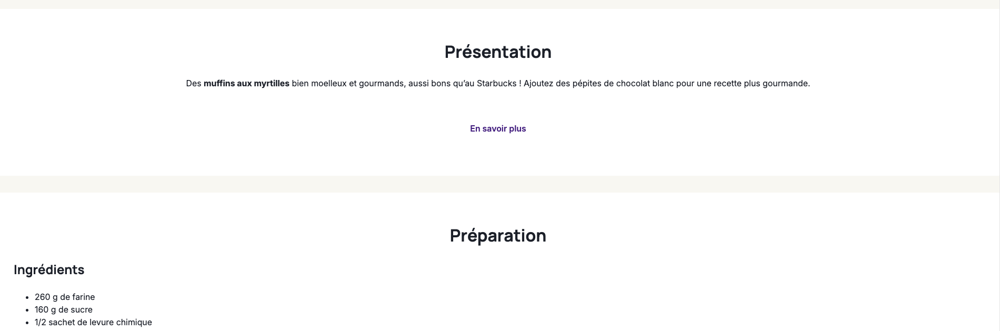

# Jour 1 - HTML & CSS - Partie 2

### <a href="https://github.com/Joz84/ten-hours-of-html-css" target="_blank">Retour au menu principal</a>

## Lien vers la <a href="https://annecemech.github.io/html-css-part-2/" target="_blank">démo</a>

## Les divisions

### Le titre principal

Nous souhaitons encadrer le titre principal avec un bleu foncé. Pour cela nous avons besoin d'une nouvelle balise : la balise division `<div></div>`. Par exemple pour cette section :

#### HTML

```html
<div>
	<h1>Muffins à la myrtille</h1>
	<p>Par Ôdélices</p>
</div>
```

Il faut en suite ajouter le CSS associé pour modifier le style du cadre :

#### CSS

```css
div {
	background: #1c232f;
}
```

## Exercice - Les cards sur fond blanc

Encadrer les autres sections avec la balise `<div>` pour que celles-ci soient également cadrées comme présenté sur l'image ci dessous :


Problème, comment faire pour donner un fond blanc à ces div alors que les précédentes ont un fond gris ?

## Les classes

Pour résoudre ce problème nous allons ajouter des classes aux divs que nous souhaitons voir comme des cartes blanches. Par exemple :

```html
<div class="card">
	<h2>La recette en vidéo</h2>
	<iframe
		width="560"
		height="315"
		src="https://www.youtube-nocookie.com/embed/PFpUJWOh8Vk?si=UYUKWs6tr4fZp4pf&amp;controls=0"
		title="YouTube video player"
		frameborder="0"
		allow="accelerometer; autoplay; clipboard-write; encrypted-media; gyroscope; picture-in-picture; web-share"
		referrerpolicy="strict-origin-when-cross-origin"
		allowfullscreen
	></iframe>
</div>
```

#### CSS

```css
.card {
	background: #ffffff;
}
```

Cela a bien appliqué un background blanc uniquement aux div qui portent cette classe.

Problème, si j'ajoute une nouvelle div, sans classe, celle-ci aura un fond gris foncé car c'est comme cela que je l'ai défini juste au dessus. Pour résoudre ce problème, je vais venir ajouter une classe à mon titre principal.

```html
<div class="header">
	<h1>Muffins à la myrtille</h1>
	<p class="subtitle">Par Ôdélices</p>
</div>
```

```css
.header {
	background: #1c232f;
}
```

Je veux maintenant donner au contenu de mon site une largeur fixe et faire en sorte qu'il soit centré dans la page. Pour cela je vais créer un container. J'ajoute une div qui engloble l'ensemble des éléments à "contenir" et je lui donne la classe 'container'.

#### HTML

```html
<div class="container">
	...
	<div class="card">
		<h2>Présentation</h2>
		<ul>
			...
		</ul>
	</div>
	<div class="card">
		<h2>Préparation</h2>
		<ol>
			...
		</ol>
	</div>
	...
</div>
```

#### CSS

```css
.container {
	width: 1140px;
	margin: 0 auto;
}
```

Je donne à l'élément une largeur fixe (width), et pour le centrer l'élément horizontalement je lui donne une marge de 0 en haut et en bas et auto à gauche et à droite.

### Mise en forme du bouton

#### HTML

```html
<a href="https://odelices.ouest-france.fr/recette/muffins-aux-myrtilles-r107/" target="_blank" class="btn-primary">
	En savoir plus
</a>
```

#### CSS

```css
.btn-primary {
	display: inline-block;
	border-radius: 2px;
	padding: 1rem 2rem;
	font-weight: 600;
	border: solid 2px #886176;
	color: #886176;
	transition: all 0.3s;
}

.btn-primary:hover {
	color: #f9f8f4;
	background-color: #886176;
	transition: all 0.3s;
}
```

### Mise en forme de l'image de la recette

Actuellement, l'image est trop grande, je vais donc lui donner une largeur de 100% et une hauteur de 400px. Pour venir cibler cette image, j'utilise un id, car ces propriétés css ne seront pas valables que pour cette image du site.

#### HTML

```html

```

#### CSS

```css
#recipe-image {
	width: 100%;
	height: 400px;
	object-fit: cover;
	display: block;
}
```

La propriété object-fit: cover; permet de conserver les proportions de l'image tout en la redimensionnant pour qu'elle couvre toute la surface de l'élément.

La propriété display: block; permet de supprimer l'espace vide en dessous de l'image.

### Mise en forme des badges 'difficulté', 'temps de préparation' et 'temps de cuisson'

Pour pouvoir venir appliquer une mise en forme spécifique à ces éléments, je vais venir les encadrer d'une balise `<span>` et leur donner une classe.

#### HTML

```html
<li>
	<span class="badge background-secondary">Difficulté</span>
	Très facile
</li>
```

#### CSS

```css
.badge {
	background-color: #886176;
	color: #f9f8f4;
	border-radius: 2px;
	padding: 0.5em 1em;
}
```

### Finalisation de la mise en forme avec les classes utilitaires

Pour finaliser l'intégration de ma page, j'ai besoin de quelques classes utilitaires pour espacer les éléments, centrer les contenus... Ces classes ne contiennent qu'une seule propriété css et ont pour but de simplifier le code et de rendre le site plus facile à maintenir, par exemple :

#### CSS

```css
.list-inline li {
	display: inline;
}

.text-center {
	text-align: center;
}

.mr-1em {
	margin-right: 1em;
}

.my-2rem {
	margin-top: 2rem;
	margin-bottom: 2rem;
}
```
