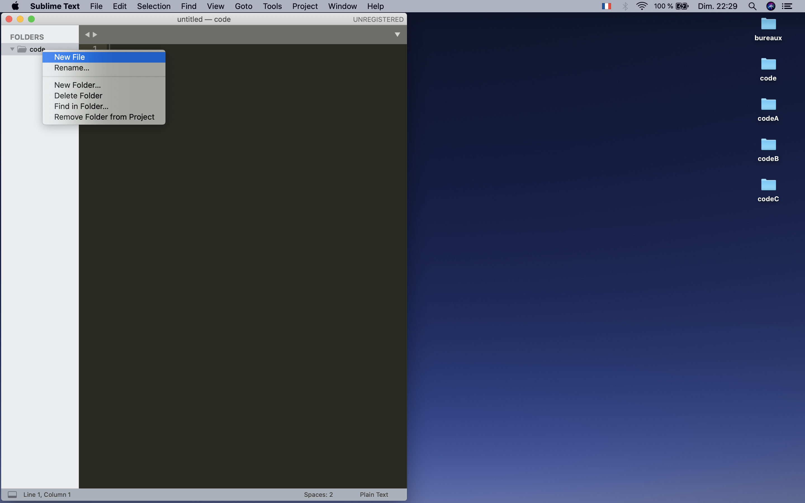

# Jour 1 - HTML & CSS - Partie 1

## Le lien vers la <a href="https://annecemech.github.io/html-css-part-1/" target="_blanck">démo</a>

## Les autres liens utiles

Les diapositives du 1er cours sont disponibles à l'adresse suivante :
<a href="https://docs.google.com/presentation/d/e/2PACX-1vS8hxL-8XySCIGKGnqwe2PSby6in_BGWfeDy5O-UahiQ1P_Csd4UmspQFdWydiFk6kU4ioJLxd_9S3a/pub?start=false&loop=false&delayms=3000" target="_blanck">
Cours 1</a>

## Les outils


### Chrome


Chrome est un navigateur. C'est un logiciel qui permet de visualiser une page web.

Chaque logiciel attend un certain type de fichier avec une extension bien particulière. Par exemple :

- Le tableur Excel attend des fichiers du type "tableau.xls".
- Le lecteur vidéo VLC attend des fichiers du type "video.mp4".
- Le navigateur Chrome attend des fichiers du type "index.html" et "style.css".

<kbd>
  
</kbd>

### Sublime Text


Sublime Text est un éditeur de text qui permet d'écrire des fichiers textes et de les sauvegarder au format choisi. Dans notre cas nous l'utiliserons pour écrire les fichiers "index.html" et "style.css".

C'est le seul logiciel qu'il est nécessaire d'installer pour suivre ce cours. Voici le lien :
<a href="https://www.sublimetext.com/3" target="_blanck">Télécharger Sublime Text</a>

### GitHub


GitHub est une plateforme web qui permet stocker et de partager son travail en ligne et héberger des sites statiques. Dans ce cours nous utiliserons cette plateforme à la fois pour partager les supports de cours et héberger le site web que nous allos produire. Pour pouvoir suivre ce cours il est donc nécessaire de se créer un compte. Voici le lien :
<a href="https://github.com/" target="_blanck">S'incrire sur GitHub</a>

## Présentation rapide des langages

### Le langage HTML


Le langage HTML (Hypertext Markup Language) a été créé par Tim Berners-Lee en 1989.

C'est un Langage balisé qui permet d'écrire le contenu et structure d'un page web.

Exemple de rendu HTML sans CSS :
<kbd>

</kbd>

### Le langage CSS


Le langage CSS (Cascading Style Sheets) a aussi été créé par Tim Berners-Lee en 1990.

C'est un langage qui permet de définir la présentation et mise en page d'une page web.

Exemple de rendu HTML avec CSS :
<kbd>

</kbd>

## Commencer une page web

### Créer le dossier "code" contenant le projet

- Créer un dossier "code".
- Ouvrir le logiciel Sublime Text et faire glisser le dossier "code" à l'interieur.
  

### Créer le fichier HTML

- Créer un nouveau fichier en tapant clique droit sur le dossier "code" apparent sur la partie gauche dans Sublime Text puis cliquer sur "new file".
  

- Sauvegarder le fichier en cliquant sur "File" puis "Save".
  

- Taper le nom du fichier "index.html" (attention, petite liste des erreurs classiques : "index.html" est sans "I" majuscule, sans "e" à la fin et l'extenstion est bien "html" et pas "htlm"). Assurer vous d'être bien dans le dossier "code" avant de sauvegarder.
  

### Visualiser le résultat dans le navigateur

- Ne pas oublier de sauvegarder tous les fichiers ouverts dans Sublime Text.
- Ouvrir le dossier "code" en cliquant dessus.
- Taper clique droit sur le fichier "index.html", puis "Ouvrir avec" et choisir le navigateur Chrome.
  

- Automatiquement le navigateur s'ouvre avec et présente la page web
  

## Le fichier HTML


### Le squelette

Le squelette de la page HTML comprend deux parties.

- Une partie "HEAD" pour les informations nécéssaires mais non visibles (comme par exemple autoriser les carractères avec accent).
- Une partie "BODY" qui contient tout le contenu visible de page.
  Pour générer automatiquement le squelette taper `html` dans le fichier index.html puis la touche "tabulations".

```html
<!DOCTYPE html>
<html>
	<head>
		<title></title>
	</head>
	<body></body>
</html>
```

Pour pouvoir utiliser des carractères avec accent il faut rajouter la la ligne `<meta charset="UTF-8">` dans la partie "HEAD" :

```html
<head>
	<meta charset="UTF-8" />
	<title></title>
</head>
...
```

Pour personnaliser le nom présent dans l'onglet du navigateur on doit spécifier un "title"

```html
<head>
	<meta charset="UTF-8" />
	<title>Jour 1</title>
</head>
```

### Le titre principal

Pour écrire un titre dans la page il faut utiliser la balise "h1" (header 1).

```html
<body>
	<h1>Muffins à la myrtille</h1>
</body>
```

### Les sous-titres

De la même manière, on souhaite ajouter des sous-titres en utilisant les balise "h2" (header 2), "h3" (header 3)...
Ils existent 6 niveaux de sous-titres.

### Les paragraphes

On peut également ajouter un paragraphe grâce à la balise "p".

```html
<h2>Présentation</h2>
<p>
	Des muffins aux myrtilles bien moelleux et gourmands, aussi bons qu’au Starbucks ! Ajoutez des pépites de chocolat
	blanc pour une recette plus gourmande.
</p>
```

### Les listes non-ordonnées (Unordered List)

La balise pour créer une liste non ordonnée est la balise "ul". Une liste est composée de plusieurs items, il faut donc créer un balise "li" (List Item) par item.

```html
<h3>Ingrédients</h3>
<ul>
	<li>260 g de farine</li>
	<li>160 g de sucre</li>
	<li>1/2 sachet de levure chimique</li>
	<li>1 pincée de sel</li>
	<li>2 oeufs</li>
	<li>6 cl d'huile'</li>
	<li>14 cl de lait</li>
	<li>200 g de myrtilles</li>
</ul>
```

La difficulté, temps de préparation, temps de cuisson peuvent également être considérés comme des items d'une liste non ordonnée auquels ont viendra appliquer un style particulier.

````html
### Les listes ordonnées (Ordered List) Ils existent aussi des listes ordonnées. La balise associée est la balise "ol".
```html
<h3>Étapes</h3>
<ol>
	<li>Préchauffez le four à 180°C (thermostat 6).</li>
	<li>Dans un saladier, tamisez ensemble la farine, le sucre, la levure et le sel.</li>
	<li>Dans un autre récipient, battez les oeufs avec un fouet. Ajoutez l’huile et le lait.</li>
	<li>
		Mélangez les deux préparations, juste pour qu’elles soient homogènes. Ajoutez les myrtilles et mélangez de nouveau
		mais ne travaillez pas trop la pâte.
	</li>
	<li>Répartissez la préparation dans 12 moules à muffins beurrés ou huilés.</li>
	<li>Enfournez 20 à 25 min.</li>
	<li>Laissez-les refroidir sur une grille.</li>
</ol>
````

### La structure d'une balise

Une balise peut être constituée de 4 parties :

- Le tag (ex: h1)
- Les attributs (ex: width)
- La valeur associée (ex: 200px)
- Le text apparent

```html
<tag attribut="valeur">text apparent à l'écran</tag>
```

### Les liens de page en page

La balise pour lier deux pages est la balise "a".

```html
<a
	href="https://odelices.ouest-france.fr/recette/muffins-aux-myrtilles-r107/"
	target="_blank"
	class="btn btn-primary my-2rem"
></a>
```

### Les images

- Créer un dossier nommé "images".

- Télécharger une image d'un site de photo libre de droits, de qualité et gratuite.
  Exemples:
  - https://flickr.com
  - https://www.pexels.com
  - https://unsplash.com


- Ranger la photo dans le dossier "images".

- Renommer l'image avec un nom simple, sans accent et sans espace (ex: "blueberry-muffin.jpg").

La balise pour insérer une image est la balise "img", elle contient au moins un attribut, l'attribut "src" ( pour "source"). La valeur de cet attribut doit être le chemin relatif de l'image. Dans notre exemple cela est "images/blueberry-muffin.jpg".

```html

```

On peut egalement ajouter l'attribut "alt" ( pour "alternative"). la valeur de cet attribut est un text décrivant au mieux l'image. Dans notre exemple "muffin". l'attribut "alt" a trois applications :

- Le text s'affiche sur la page si le navigateur ne trouve pas l'image.
- Les applications pour aveugles qui lisent la page HTML notifiront qu'il y a une image et ce quelle représente.
- Mettre une description pertinante améliore le référencement.

### Mise en page du texte

Pour mettre une partie du texte en gras, on peut utiliser deux balises :

- La balise `<b>`
- La balise `<strong>` qui, en plus de mettre le texte en gras, permet de faire en sorte que se texte soit pris en compte pour améliorer le référencement.

Pour mettre le texte en italique on peut utiliser la balise `<i>`.

Voic un exemple de paragraphe avec les différentes balises de mise en page :

```html
<p>
	Des
	<strong>muffins aux myrtilles</strong>
	bien moelleux et gourmands, aussi bons qu’au Starbucks !
	<br />
	Ajoutez des pépites de chocolat blanc pour une recette plus gourmande.
</p>
```

## Rendu final du fichier HTML

<kbd>
  
</kbd>

## Créer et lier le fichier CSS

### Créer le fichier CSS

- Créer un nouveau fichier en tapant clique droit sur le dossier "code" apparent sur la partie gauche dans Sublime Text puis cliquer sur "new file".
  

- Sauvegarder le fichier en cliquant sur "File" puis "Save".
  

- Taper le nom du fichier "style.css" (attention, petite liste des erreurs classiques : "style.css" est sans "S" majuscule et l'extenstion est bien "css" et pas "ccs"). Assurer vous d'être bien dans le dossier "code" avant de sauvegarder.
  

### Faire le lien entre le fichier HTML et le le fichier CSS

- Se postionner juste avant la fermeture de la balise `<head>` dans le fichier "index.html".
- taper `link` puis la touche "tabulations". On obtient la balise `<link>` qui permet de lier un fichier de style au fichier HTML.
- La valeur de l'attribut "href" est le nom du fichier CSS, soit dans notre exemple "style.css".

```html
<head>
	[...]
	<link rel="stylesheet" href="style.css" />
</head>
```

## Le fichier CSS


### Appliquer du style au titre principal h1

Dans le fichier "style.css" taper le nom du sélecteur (par exemple: `h1` suivi des accolades `{}`. L'ensemble des propriétés qui s'appliqueront à ce sélecteur seront listées à l'interieur de ces accolades.

```css
h1 {
	font-size: 64px;
	margin: 0px;
	text-transform: uppercase;
	color: #886176;
}
```

### Appliquer du style à plusieurs balises en une seule fois

Les balises concernées sont séparées par une virgules.

```css
h2,
h3 {
	color: #1c232f;
}

p,
li {
	line-height: 1.5em;
}
```

### Aplliquer du style à toute la page

Pour cela on peut utiliser la balise `<body>`

```css
body {
	margin: 0;
	background-color: #f9f8f4;
	font-family: "Inter", sans-serif;
	color: #1c232f;
}
```

### Positionner le texte dans la page

Pour cela on peut utiliser la propriété `text-align`.

```css
body {
	margin: 0;
	background-color: #f9f8f4;
	font-family: "Inter", sans-serif;
	color: #1c232f;
	text-align: center;
}

li {
	text-align: left;
}
```

### Mettre les éléments d'une liste en ligne

```css
ul li {
	display: inline;
}
```

### Aplliquer du style à une image

```css
img {
	width: 100%;
	height: 400px;
	object-fit: cover;
}
```

### Appliquer du style à un lien

Le suffixe `:hover` permet d'appliquer du style au lien lorsque la souris survole le lien.

```css
a {
	text-decoration: none;
	color: #886176;
}

a:hover {
	color: #1c232f;
}
```

## Utiliser une police google

Google fonts (https://fonts.google.com/)

- Aller sur le site google fonts.
- Sélectionner une police en cliquant "get font" à droite de la page.
  <kbd>
  
  </kbd>

- Cliquer sur le panier en haut à droite puis cliquer sur "get embed code", puis copier le code présent dans la section "Embed code in the <head> of your html" `<link rel="preconnect" href="https://fonts.googleapis.com">
<link rel="preconnect" href="https://fonts.gstatic.com" crossorigin>
<link href="https://fonts.googleapis.com/css2?family=Inter:ital,opsz,wght@0,14..32,100..900;1,14..32,100..900&family=Manrope:wght@200..800&display=swap" rel="stylesheet">`.
  <kbd>
  
  </kbd>
- Coller le code obtenu dans le fichier HTML au dessus de la ligne `<link rel="stylesheet" href="style.css">`

Soit :

```html
<head>
	<meta charset="utf-8" />
	<meta name="viewport" content="width=device-width, initial-scale=1" />
	<link rel="preconnect" href="https://fonts.googleapis.com" />
	<link rel="preconnect" href="https://fonts.gstatic.com" crossorigin />
	<link
		href="https://fonts.googleapis.com/css2?family=Inter:ital,opsz,wght@0,14..32,100..900;1,14..32,100..900&family=Manrope:wght@200..800&display=swap"
		rel="stylesheet"
	/>
	<link rel="stylesheet" type="text/css" href="style.css" />
	<title>Muffins à la myrtille</title>
</head>
```

- Copier la propriété CSS de la forme `font-family: 'Pacifico', cursive;`.
- Coller dans le fichier CSS :

```css
h1 {
	font-family: "Manrope", system-ui;
}

body {
	font-family: "Inter", sans-serif;
}
```

## Insérer une vidéo Youtube

- Aller sur Youtube et choisir une video (https://www.youtube.com/watch?v=fBuSNu2m3XA&feature=youtu.be)
- Cliquer sur "Partager" puis "Intégrer".
- Copier le code d'intégration".
  <kbd>
  
  </kbd>

- Coller le code dans le fichier html la où vous souhaitez intégrer la vidéo :

Remarque : Il est possible de changer la taille de la vidéo grâce aux attributs "width" et "height".

```html
<h3>La recette en vidéo</h3>
<iframe
	width="500"
	height="300"
	src="https://www.youtube.com/embed/fBuSNu2m3XA"
	frameborder="0"
	allow="accelerometer; autoplay; encrypted-media; gyroscope; picture-in-picture"
	allowfullscreen
></iframe>
```

## Rendu final du fichier HTML avec le fichier CSS

<kbd>
  
</kbd>
